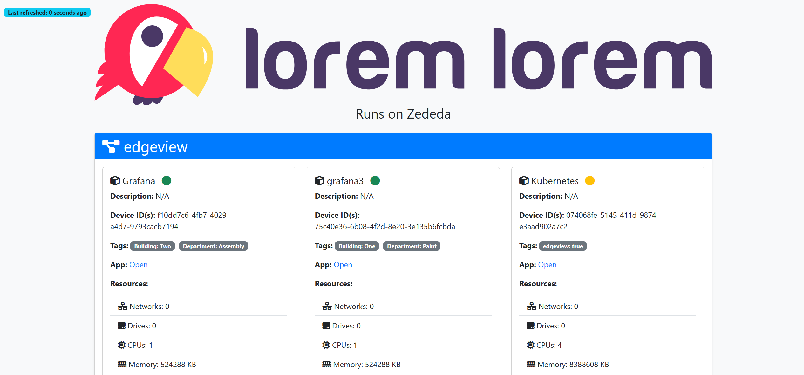

# ExampleApp



**ExampleApp** is a robust and scalable application designed to showcase the extensibility of the Zededa API. Containerized using Docker, it ensures consistent performance across different environments and simplifies deployment to edge devices via Zededa.  This application is not entirely finished.  I need to implement the start/stop/restart functions for the applications.  I also need to fix the auto update feature. The "open application" link feature is currently hard coded, this needs to be implemented as well.  Lastly I need to add Zededa deployment instructions.

## Table of Contents

- [Description](#description)
- [Prerequisites](#prerequisites)
- [Installation](#installation)
- [Environment Variables](#environment-variables)
- [Building the Docker Container](#building-the-docker-container)
- [Running the Docker Container](#running-the-docker-container)
- [Deploying to Zededa](#deploying-to-zededa)
- [Usage](#usage)
- [Contributing](#contributing)
- [License](#license)
- [Contact](#contact)

## Description

ExampleApp is a web app who's purpose is to show the extensibility of the Zededa API. It leverages the power of Docker for containerization and Zededa's edge computing platform for deployment, ensuring high availability and scalability, and makes heavy use of Zededa's REST API.

## Prerequisites

Before you begin, ensure you have met the following requirements:

- **Docker:** Ensure Docker is installed on your machine. You can download it from [Docker's official website](https://docs.docker.com/get-docker/).
- **Zededa Account:** A valid account with access to the Zededa console for deploying applications.
- **Git:** Installed on your local machine for cloning the repository. Download from [Git's official website](https://git-scm.com/downloads).

## Installation

1. **Clone the Repository**

   Open your terminal and run:

   ```bash
   git clone https://github.com/krisclarkdev/exampleapp.git
   cd exampleapp
   ```

2. **Review the Project Structure**

   Familiarize yourself with the project's files and directories.

   ```bash
   ls
   ```

   Expected output:

   ```
   .gitignore  Dockerfile  README.md  app.js  package.json  package-lock.json  public/  views/
   ```

## Environment Variables

ExampleApp requires two critical environment variables to function correctly:

- `API_TOKEN`: Your API token for authenticating requests.
- `ZURL`: The Zededa API endpoint or URL.

### Setting Environment Variables

You can set these environment variables in multiple ways when running the Docker container.

#### a. Using Docker Run with `-e` Flags

Pass the environment variables directly in the `docker run` command using the `-e` flag.

```bash
docker run -d   -p 3000:3000   --name exampleapp   -e API_TOKEN=your_actual_api_token_here   -e ZURL=your_zededa_url_here   krisclarkdev/exampleapp
```

**Explanation:**

- `-d`: Runs the container in detached mode (in the background).
- `-p 3000:3000`: Maps port 3000 of the host to port 3000 of the container.
- `--name exampleapp`: Names the container `exampleapp` for easier reference.
- `-e API_TOKEN=...`: Sets the `API_TOKEN` environment variable inside the container.
- `-e ZURL=...`: Sets the `ZURL` environment variable inside the container.
- `krisclarkdev/exampleapp`: Specifies the Docker image to use.

#### b. Using an Environment File with `--env-file`

For better manageability, especially with multiple environment variables, use an environment file.

1. **Create a `.env` File**

   In the project root directory, create a file named `.env`:

   ```env
   # .env

   API_TOKEN=your_actual_api_token_here
   ZURL=your_zededa_url_here
   ```

   **Security Tip:** Ensure this file is added to `.gitignore` to prevent it from being committed to version control.

2. **Run Docker with the Environment File**

   ```bash
   docker run -d      -p 3000:3000      --name exampleapp      --env-file .env      krisclarkdev/exampleapp
   ```

#### c. Using Docker Compose

Docker Compose offers a streamlined way to manage environment variables and container configurations.

1. **Create a `docker-compose.yml` File**

   In the project root directory, create a `docker-compose.yml` file:

   ```yaml
   version: '3.8'

   services:
     exampleapp:
       image: krisclarkdev/exampleapp
       container_name: exampleapp
       ports:
         - "3000:3000"
       env_file:
         - .env.prod
       restart: unless-stopped
   ```

2. **Create an Environment File**

   Create a `.env.prod` file with your environment variables:

   ```env
   # .env.prod

   API_TOKEN=your_actual_api_token_here
   ZURL=your_zededa_url_here
   ```

3. **Run Docker Compose**

   ```bash
   docker-compose up -d
   ```

## Building the Docker Container

Before deploying, you need to build the Docker image for ExampleApp.

1. **Navigate to the Project Directory**

   Ensure you're in the root directory of the project.

   ```bash
   cd exampleapp
   ```

2. **Build the Docker Image**

   Run the following command to build the Docker image:

   ```bash
   docker build -t krisclarkdev/exampleapp .
   ```

3. **Verify the Image**

   After building, verify that the image exists:

   ```bash
   docker images
   ```

## Running the Docker Container

After building the Docker image, run the container using one of the methods outlined in the [Environment Variables](#environment-variables) section.

### Example Using Environment File

1. **Ensure the `.env` File Exists**

   Confirm that your `.env` file contains the necessary environment variables:

   ```env
   # .env

   API_TOKEN=your_actual_api_token_here
   ZURL=your_zededa_url_here
   ```

2. **Run the Container**

   ```bash
   docker run -d      -p 3000:3000      --name exampleapp      --env-file .env      krisclarkdev/exampleapp
   ```

## Deploying to Zededa

TODO: Create this section

## Contributing

Contributions are welcome! Follow these steps to contribute to ExampleApp:

1. **Fork the Repository**

   Click on the **Fork** button at the top-right corner of the repository page to create a copy of the repository in your GitHub account.

2. **Clone Your Fork**

   ```bash
   git clone https://github.com/your_username/exampleapp.git
   cd exampleapp
   ```

3. **Create a New Branch**

   ```bash
   git checkout -b feature/YourFeatureName
   ```

4. **Make Your Changes**

   Implement your feature or bug fix.

5. **Commit Your Changes**

   ```bash
   git commit -m "Add Your Feature Description"
   ```

6. **Push to Your Fork**

   ```bash
   git push origin feature/YourFeatureName
   ```

7. **Open a Pull Request**

   Go to your forked repository on GitHub and click on **Compare & pull request**. Provide a clear description of your changes and submit the pull request.

## License

This project is licensed under the [MIT License](LICENSE).

## Contact

For any inquiries or support, please contact:

- **Kris Clark**
- **GitHub:** [https://github.com/krisclarkdev](https://github.com/krisclarkdev)
